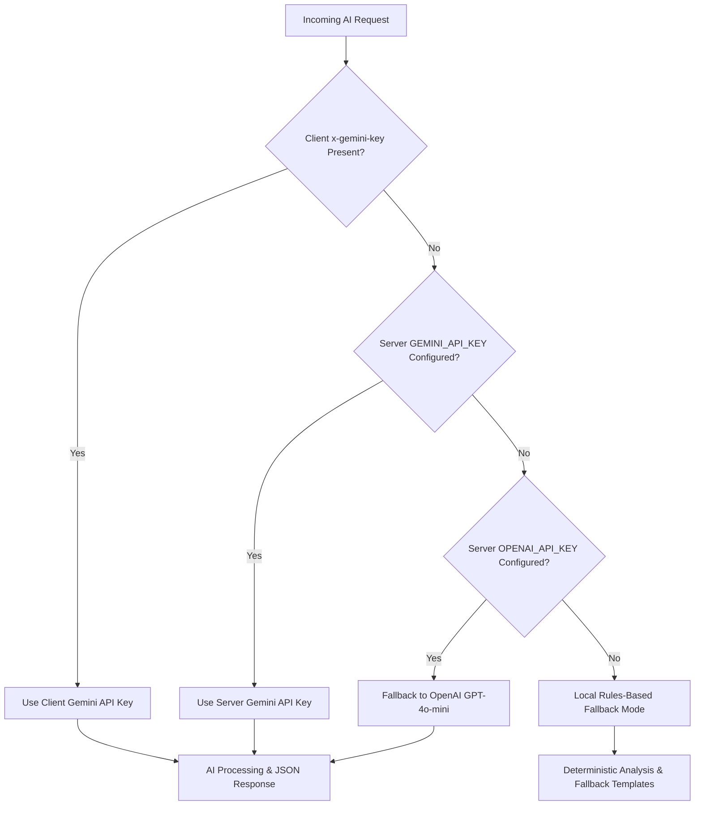

# 🧠 MindCare: AI-Powered Student Mental Wellness Tracker

MindCare is a production-ready, highly accessible, secure, and visually stunning web application designed specifically for students preparing for high-pressure examinations (such as NEET, JEE, UPSC, GATE, CAT, etc.). It helps students log their moods, analyze stress triggers, track burnout risks, keep a sentiment-analyzed reflection journal, and chat with an empathetic AI Wellness Coach—all with **100% user anonymity**.

---

## 🌟 Key Features

### 1. 🔒 100% Anonymous Client-Side Partitioning
* **No Authentication Required**: To minimize friction and protect student privacy, the app does not use a login system.
* **Local ID Generation**: On first load, the app generates a secure, persistent UUID stored in the browser's `localStorage`. All database records are keyed to this UUID.
* **Backup & Restore**: Users can view, copy, or load a session ID via the **Session Settings** (Key icon in the header) to transfer their reflection history to other devices.
* **Start Fresh Session**: Allows users to instantly generate a brand new ID and clear local states, resetting the dashboard.

### 2. ⚡ Hybrid Burnout Detection Engine
* **Rules-Based Baseline**: Computes a foundation score (0-100) based on clinical distress metrics: consecutive high-stress entries, low sleep hours ($<6\text{ hrs}$), study loads ($>12\text{ hrs}$), and negative mood swings.
* **Generative AI Enhancements**: The AI evaluates free-form reflection texts to adjust the burnout risk score dynamically and extract precise contributing factors.
* **Actionable Recommendations**: Groups personalized recommendations into four categories: **Study**, **Mental**, **Physical**, and **Sleep**.

### 3. 🌅 "Result Season" Support Mode
* **Manual Toggle**: A toggle in the header transitions the application theme from cool calming indigos to a comforting, warm sunset amber palette.
* **AI Behavioral Update**: Modifies the AI Wellness Coach instructions to focus heavily on coping with result uncertainty, dealing with disappointment, and managing parent/peer expectations.

### 4. 💬 Empathetic AI Wellness Coach (CalmGuide)
* **Real-time SSE Streaming**: Employs native browser streaming readers (`ReadableStream`) for instant assistant response generation.
* **Strict Safety Rails**: Implements medical disclaimers and checks for self-harm/psychiatric distress triggers to display crisis helplines (AASRA, Vandrevala Foundation) automatically.

### 5. 📖 Sentiment Reflection Journal
* **Interactive Journal Logs**: Allows students to filter entries by keywords or date ranges.
* **AI Summaries**: Each entry is analyzed for sentiment (ranged from `-1.0` to `+1.0`) and summarized in a single sentence.

### 6. 🔑 Client-Side API Key Input
* Users can enter their own **Gemini API Key** in the **Session Settings** modal (complete with a password visibility toggle).
* Client-supplied keys are persisted locally in `localStorage` and sent via the `x-gemini-key` header to Next.js API routes, keeping usage completely independent.

---

## ⚙️ AI Cascading Hierarchy
Every AI route (`/api/check-in`, `/api/journal`, `/api/chat`) follows a resilient cascading path to ensure the app remains functional under any setup:



---

## 🗄️ Database Schema

MindCare is powered by **Supabase**. The database schema is located at `supabase/migrations/20260606000000_init_schema.sql` and contains four main tables:

### 1. `mood_entries`
Stores daily mood, sleep, study hours, and stress details.
* `id` (UUID, Primary Key)
* `user_id` (UUID, client-supplied partition key)
* `mood_score` (INT, 1 to 10)
* `stress_level` (TEXT: Low, Medium, High)
* `energy_level` (TEXT: Low, Medium, High)
* `sleep_hours` (NUMERIC)
* `study_hours` (NUMERIC)
* `primary_emotion` (TEXT: Happy, Calm, Anxious, Burnt Out, etc.)
* `reflection` (TEXT)
* `created_at` (TIMESTAMP)

### 2. `stress_triggers`
Stores mapped triggers linked to mood entries.
* `id` (UUID, Primary Key)
* `user_id` (UUID)
* `mood_entry_id` (UUID, foreign key, cascades on delete)
* `trigger_name` (TEXT: Mock Exams, Sleep Deprivation, Parents, Peer Competition, etc.)

### 3. `journal_entries`
Stores sentiment analysis logs and AI summaries.
* `id` (UUID, Primary Key)
* `user_id` (UUID)
* `content` (TEXT)
* `sentiment_score` (NUMERIC, -1.0 to 1.0)
* `ai_summary` (TEXT)
* `created_at` (TIMESTAMP)

### 4. `ai_insights`
Stores weekly/daily burnout metrics and customized study-life actions.
* `id` (UUID, Primary Key)
* `user_id` (UUID)
* `burnout_score` (INT, 0 to 100)
* `burnout_level` (TEXT: Low Risk, Moderate Risk, High Risk)
* `insight` (TEXT)
* `recommendation` (JSONB)
* `created_at` (TIMESTAMP)

*All tables are optimized with indexes on `(user_id, created_at DESC)` for efficient client-side filtering.*

---

## 🚀 Getting Started

### 1. Clone & Install Dependencies
```bash
git clone <repository-url>
cd main-hack2skill
npm install
```

### 2. Setup Environment Variables
Create a `.env` file in the root directory and specify the following details:
```ini
# Supabase Project Credentials
NEXT_PUBLIC_SUPABASE_URL=https://your-supabase-id.supabase.co
NEXT_PUBLIC_SUPABASE_ANON_KEY=eyJhbGciOiJIUzI1NiIsInR5cCI6IkpXVCJ9...

# Server-Side AI API Keys (Optional, fallbacks are active)
GEMINI_API_KEY=AIzaSy...
OPENAI_API_KEY=sk-proj-...
```

### 3. Initialize Database Schema
Copy the SQL commands from `supabase/migrations/20260606000000_init_schema.sql` and run them in the **SQL Editor** of your Supabase project dashboard.

### 4. Run Locally
```bash
npm run dev
```
Open [http://localhost:3000](http://localhost:3000) (or the port specified in your console output) to view the application.

---

## 🧪 Testing

The test suite validates calculations, input schemas, and mock route responses.

Run all tests:
```bash
npm test
```

*The suite will run **Vitest** validating the burnout calculations, Zod validators, and API integrations (including custom header injections).*

---

## ☁️ Deployment

Deploy easily to **Vercel** by linking your Git repository:

1. Push your code to your remote repository.
2. In Vercel, select **Add New Project** $\rightarrow$ **Import Repository**.
3. Configure the environment variables matching your `.env` file.
4. Click **Deploy**.

---

## ♿ Accessibility & Design Standards
* **WCAG 2.1 AA Compliance**: Colors, typography, and contrast ratios strictly comply with web standards.
* **Keyboard Accessible**: All modals, emotion selection grids, slider targets, and password toggles are fully navigable using the `Tab` and `Enter` keys.
* **Responsive Layouts**: Designed using mobile-first CSS grids and flex layouts, supporting screens from mobile (320px) up to ultra-wide desktop monitors.
